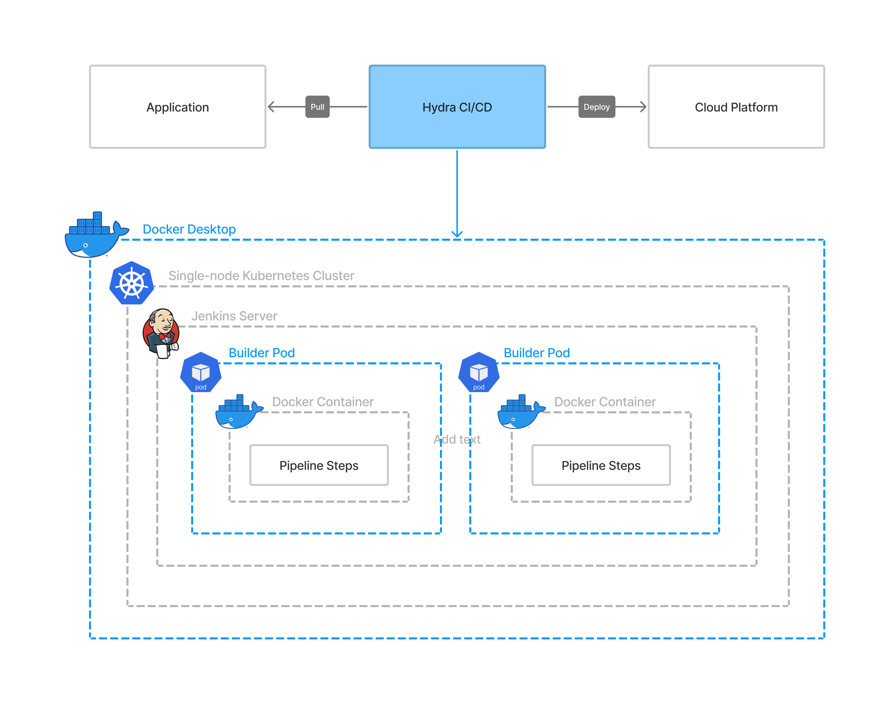

# Hydra CI/CD

Continuous integration, continuous delivery, and continuous deployment.

Automation and continuous monitoring throughout the lifecycle of apps, from integration and testing phases to delivery and deployment.

**Technologies**: Jenkins _(jdk11)_, Docker, Kubernetes, Python, and Bash. 

* [Overview](#overview)
* [Sources](#sources)

## Overview

### Sources
* [jenkins-docker-desktop](https://github.com/HakimiX/jenkins-docker-desktop)
